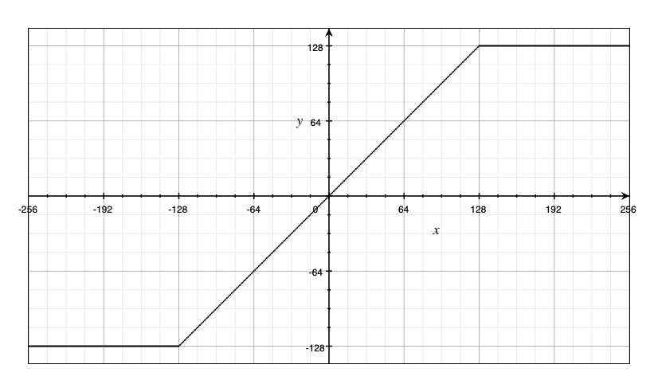
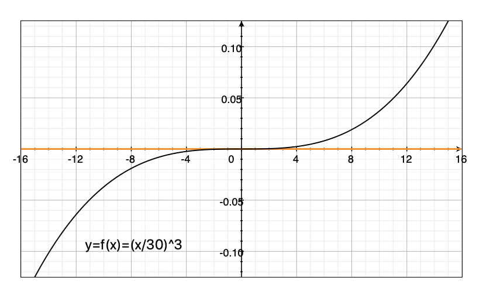
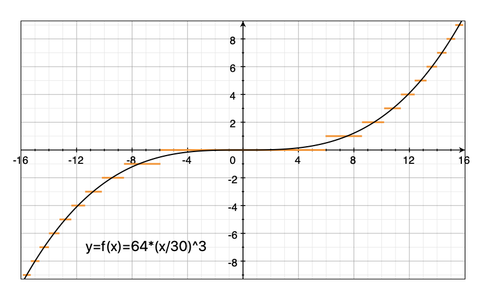
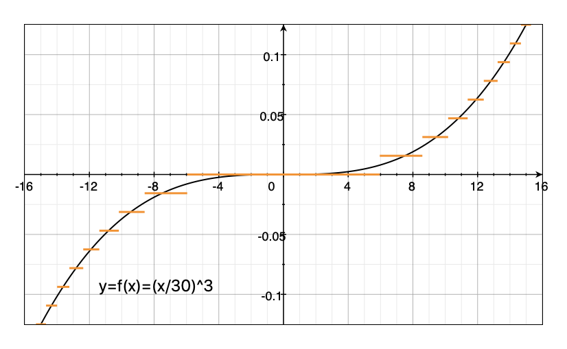
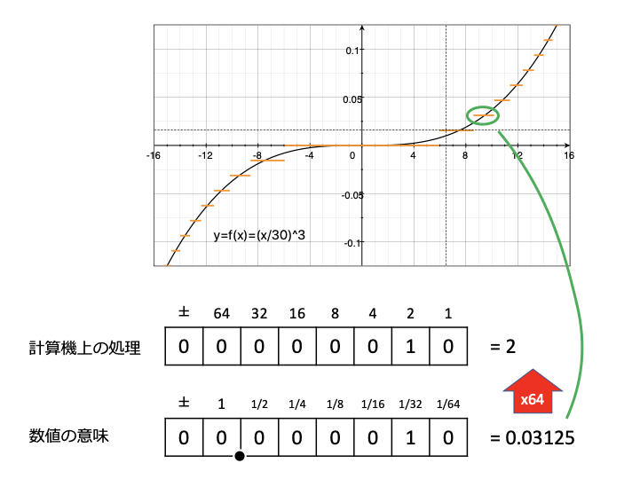
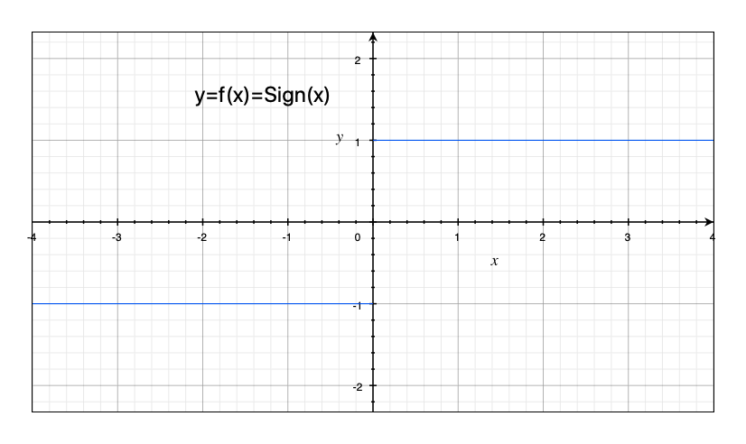
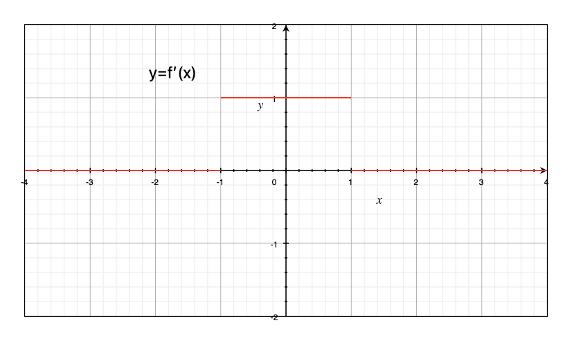

第4回： 演算ライブラリのカスタマイズ (Python実装)
===

「2021年度 B3研究プロジェクト 〜 PyTorchによるニューラルネットワーク実装と環境構築の演習」


## 概略

今回はPyTorchに標準搭載されていない演算を組み入れるための手順がメインである。
これには誤差逆伝播法 (Backpropagation) の理解が不可欠なので、まずはその導入から。

最終的には、後々FPGAやASICに搭載するようになると必要になる固定小数点数量子化 (Fixed-point) を実装してもらう。


## 関連資料
- 補足資料 (別途送付)
- PyTorch 公式ガイド [Extending PyTorch](https://pytorch.org/docs/stable/notes/extending.html), [Defining new autograd funcitons](https://pytorch.org/tutorials/beginner/examples_autograd/two_layer_net_custom_function.html)
- [How the backpropagation algorithm works](http://neuralnetworksanddeeplearning.com/chap2.html)

## 準備

### プログラムのデプロイ
Google Colabで以下のファイルを開き自分のGoogle Driveに保存する。
[ArtIC GitHub](https://github.com/ArtIC-TITECH/b3-proj-2021)の[`Exercise04/04_01_temp.ipynb`](https://github.com/ArtIC-TITECH/b3-proj-2021/blob/master/Exercise04/04_01_temp.ipynb)


## 演習課題の進行

### テンプレ解説
テンプレートはこれまでの蓄積の上にあるが、今回も差分がある。

- Optuna対応は一度外した。試してみるやる気があったらぜひ自分で組み込んでみよう。
- カスタム演算に対応するためのベアボーンなクラスを追加した。


### 「自動微分可能」 (autograd-capable) な演算
PyTorchにおいて新しい演算を組み入れるときは、主に `torch.nn.Module` または `torch.autograd.Function` を継承したサブクラスを作って実装する。
両者の違いとして、 `Module` は変数と状態を持てる一方、明示的な逆伝播関数を定義できるのは `Function` の方である。
典型的には `Function` で関数を作り、それをハイパーパラメータや状態・係数の変数とともに呼び出す `Module` を作る (一つのクラスにまとめて定義することもできる… [補足](#%E8%A3%9C%E8%B6%B3) 参照)。
これまでに使ってきたもので考えると、 `nn.Conv2d` は `Module` サブクラスで、これは内部に `weight` という変数（正確には `torch.Variable` のサブクラスである `torch.Parameter` インスタンス）を持ち、これと入力を `torch.nn.functional.conv2d()` 関数に渡している。

**なお普通のPython及びPyTorch内蔵関数の組み合わせで順伝播を記述でき、かつその逆伝播が特殊な計算を要求せず構成演算の純粋な逆伝播計算で良い場合は、特に自分で逆伝播対応のクラスを書くまでもない。**
自動微分可能な演算を組み合わせた演算もまた自動微分可能である。
例えば以下は自動微分可能な関数である。
```python:
def madd(a, b, c):
    return a * b + c
```

近似が必要な関数、標準の自動微分に任せると不安定になる関数（数学的に微分できない点があり、それを踏むと値が発散する関数等）などは、自分で逆伝播計算を明示的に実装する。

### `torch.autograd.Function` クラスの使い方
このクラスを継承し、スタティックメソッドとして `forward()` と `backward()` をオーバーライドする。
そのクラスの `apply()` スタティックメソッドが順伝播の関数として働き、これを組み入れた演算の逆伝播で自動的に `backward()` が呼ばれる。

逆伝播時に必要となる中間結果は `context.save_for_backward()` で保存し、 `backward()` メソッド内で `context.saved_tensors` として取り出す。

ここで今回の5番セルを見てみよう。

```python:
from torch.autograd import Function

# A quantization function that emulates int8 (-128..127) in float expression
class Int8InFloatFunction(Function):
    @staticmethod
    def forward(ctx, input):
        ctx.save_for_backward(input)
        return torch.clamp(torch.round(input), -128, 127)

    @staticmethod
    def backward(ctx, grad_out):
        input = ctx.saved_tensors[0]
        # WHAT SHOULD BE HERE?

int8_in_float = Int8InFloatFunction.apply
```

これは任意の `float32` （32ビット符号付浮動小数点数）テンソルを、浮動小数点数のまま、8ビット符号付整数で表現可能な `-128` 〜 `127` の数に "量子化" する関数を作ろうとしている。
`forward()` メソッドに関しては見たままで、入力 `input` を四捨五入により整数のみを取る浮動小数点数に変換し、それを8ビット整数の定義域である `-128` 〜 `127` でクリッピングして返している。

なお `forward()` メソッドは以下のように規定されている。
- 第1引数は `context` 。順伝播中の途中結果等、「文脈依存」の一時記憶
- 第2引数以降、必要な数だけ入力を取れる
- 出力も必要な数だけ tuple として返せば良い




さあ、逆伝播には何をすべきか？
実はそこも議論の余地の残るところで、実は何もせずに線型関数を仮定しても動くかもしれない。
が、今回はあえて `forward()` が行った変換に忠実な逆伝播を実装してみる。

これは定義域である `-128` 〜 `127` で線型であるので導関数は *f'(u) = 1* 、それをはみだすと値は定数に張り付くので *f'(u) = 0* である。


資料で説明した逆伝播の考え方に則り、 *dL/du = dL/dy f'(u)* を計算すると、単に入力が `-128` 〜 `127` だったところのみ出力誤差を伝播すれば良いことがわかる。
なので、それを書くのだが、 **PyTorchの演算はGPU上でバッチ的に処理されているので、１要素ずつ `if` 文で比べるなどというのは非現実的である。**
そこで便利なのが [`torch.where()` 関数](https://pytorch.org/docs/stable/torch.html#torch.where) である。
これは `torch.where(条件を表すbool型テンソル, Trueの時, Falseのとき)` というように使う。
３つの引数は全て同じshapeの `Tensor` である必要がある。
第1引数の各要素について、 `True` であれば第2引数から、 `False` であれば第3引数から対応する位置の要素を抜いてくる。
いわばelement-wiseな三項演算子である。
Excelの `IF` 関数を思い浮かべてもらうと良い。

<div style="padding:20em 0em 20em 0em; text-align:center; background-color:#EEDDEE">
    考えてみよう。一通り考えてからスクロール
</div>

なので正解の一例は次のようになる。
理解できるだろうか？
```python:
    @staticmethod
    def backward(ctx, grad_out):
        input = ctx.saved_tensors[0]
        return torch.where(
            (input >= -128) & (input <= 127),
            grad_out,
            torch.zeros_like(grad_out)
        )
```

なお `backward()` メソッドは以下のように規定されている。
- 第1引数は `context` 。順伝播中の途中結果等、「文脈依存」の一時記憶
- 第2引数以降は、 `forward()` メソッドの返り値の順通りに出力の微分、すなわち *dL/dy* が流れてくる。
- 返り値として、 `forward()` メソッドの入力（ `context` 以降の引数）の数だけ、それに対応する微分値 *dL/dx* を返す。

つまり例えば `forward()` メソッドが2つ値をとって3つ値を返すなら `backward()` メソッドの引数は `context` の他に3つ渡されてくるので、それから2つの入力に対応する微分値をそれぞれ計算して返す。


### `torch.nn.Module` クラスでラップする
今作った `int8_in_float()` 関数は、このままだと使いにくい。
定義域が整数しかないので、微小な数をとるネットワーク係数には使えない。

例えば、このような数値（黒線）が入力されたとして、値は 0.1 より小さい程度なので、整数に丸めると全て橙線のように 0 に行ってしまう。


そこで同じ関数を64倍して整数に丸めてみると、以下のように意味のありそうな量子化ができる。



これを、数値計算を行う上では1/64倍して元の数値として扱ってみる。



すなわち、これは小数点下6桁を見る固定小数点数である。



学習環境においても実際の固定小数点演算を想定し、ビットシフトによって小数分をエミュレートしてより小さな数を表現できるようにする。
しかし、問題は小数点下桁数はハイパーパラメータであり、 `Function` クラスの引数としては使えない。
そこで、このハイパーパラメータを持つ `Module` を作る。

```python:
# Its nn.Module wrapper with fraction part bit width
class Int8Float(nn.Module):
    def __init__(self, frac=0):
        assert frac >= 0 and frac <= 7
        super(Int8Float, self).__init__()
        self.scale_r = 2.0 ** (-frac)
        self.scale_l = 2.0 ** frac

    def forward(self, input):
        # Try to explain the meaning of scale_l and scale_r parameters!
        return int8_in_float(input * self.scale_l) * self.scale_r
```

このように、 `Module` であれば初期化時ハイパーパラメータをもらって保持しておけるので、それを使って `forward()` メソッドから目的の関数を呼べば良い。
`Module` では `backward()` 関数は必要ない（実装できない）。
それは `Function` の方で対応する。

### バイナリ量子化（二値化）の実装
ここまでくれば自力で実装できるはずである。
骨格だけ作ってある `BinarySignFunction` を改造して作ってみる。

二値化関数は不連続なステップ関数であり、微分できないが、逆伝播は `-1` 〜 `1` の範囲で線型とみなせば動作することが報告されている ([M. Courbariaux, et al., "Binarized Neural Networks: Training Deep Neural Networks with Weights and Activations Constrained to +1 or -1," 2016](https://arxiv.org/abs/1602.02830)) 。






これを実現する方法はいくつかあり、最も単純なのは `torch.where()` 関数を使用することである。
別解として、 `bool` 型の `True` と `False` は内部的にはC言語の `1`, `0` という整数で表現されていることを考えると、
```python:
(a >= 0).to(a.dtype)
```
のように条件式の結果（これは `bool` 型の `Tensor` である）を元のテンソルと同じ型に変換することで閾値判定の結果を数値 `1`, `0` にすることができる。
他の任意の数値型に変換するには
```python:
(a >= 0).to(torch.float32)
```
のようにすれば良い。
実際、条件分岐は命令とメモリ領域のジャンプを食う上、特にGPU上の実行では結果の不揃いな分岐命令は非常に非効率となるため、不用意に分岐を入れるより全要素に均一な四則演算を行わせた方が速い場合がある。
同じ考えで上で作ったInt8の関数も最適化できるか考えてみるのも良い。

### モデル構築と学習
ここまで作った整数量子化とバイナリ活性を使い、8ビット整数係数・1ビットバイナリ活性のモデルを組んでみよう（最終層のバイナリ化は必要ない）。
テンプレートには既に形になっているモデルを入れてあるので、活性化関数 `act` と係数量子化関数 `quant` を適切に設定すれば動作する。

ここで一つ重要なノウハウとして、既に完成されている `nn.Linear` や `nn.Conv2d` の重み係数にどうやって量子化関数を入れ込むかという話がある。
現状定石的に取られている方法は、それらクラスを継承したサブクラスを作り、PyTorchソースのそれらの `forward()` メソッドの実装を参考に、実際に内部で演算を呼んでいる直前で量子化関数を通すように書き換えることである。


## 宿題


### 1. 量子化のインチキ探し
実は今回組んでもらった固定小数係数・バイナリ活性のネットワークには１箇所インチキが混ざっている。
このままではハード実装できないし、精度評価もフェアでない。
それはなぜか？
ネットワーク定義の部分を見ながら考えてみよう。

実習課題としては、適当な量子化、例えば `int8` 以外の固定小数点数、 三値（`-1`, `0`, `1`）、対数量子化などを実装してみる。
普通の整数演算では8, 16, 32, 64ビット以外というのは使いにくいが、今はFloatの数値表現で整数演算をエミュレートしており、さらに後々になって使うであろうFPGAアーキテクチャなどでは設計者の自由で内部演算精度を決められるので、ビット幅もパラメトライズできるようにクラスを組んで探索してみるのも良いかもしれない。

### 2. CUDAを扱うためのC/C++演習
以下のように呼び出してfloat型の配列 src を`int8`で表現できる数に変換し、float型の配列 `dst `に書き戻すC言語の関数 `quantizeInt8InFloat()` を定義してみる。

```
#include <stdio.h>
#include <math.h>

int main(void) {
    const size_t N = 256;
    float src[N], dst[N];
    /* ここで配列srcを適当に初期化する */
    quantizeInt8InFloat(N, src, dst);
    /* dstを表示する */
    return 0;
}
```
表示サンプルとしては以下のようなものを期待（分かれば良いのでこれに厳密に従う必要はない）。
```
Index      src      dst
    0   234.23   127.00
    1    -3.01    -3.00
......
```
ちなみにC言語でfloatの四捨五入を行うのは `math.h` をインクルードして `roundf()` 関数が使える。C/C++の配列の考え方が身についていないと次回は辛いので、復習しておいてもらえると助かります。優先度は「配列の全要素にわたる操作を行う関数が作れること＞量子化の完全動作」です。

ローカル環境にC言語コンパイラがない場合、オンライン上で実行可能な[Wandbox](https://wandbox.org/)というサービスがある。


様々な言語に対応しているので簡単なテストには便利である。


<!-- 次回は簡単なGPUコードを組み込むことを実習するので、
CUDAに関して予習しておくと良い。
なお研究室のGPU実験サーバにはCUDA環境が整っているため、チュートリアルなどでの.cuコードは実験サーバでコンパイル・実行できる。 -->


## 補足

### `Module` インスタンスの内部で `Function` サブクラスを作る
実は `Module` サブクラスのイニシャライザ（`__init__()` メソッド）内部で動的に `Function` サブクラスを作ることで、ハイパーパラメータつきの `Function` を別クラスとして定義しなくても動作できる。
これは完全にTipsというかノウハウというか、そういうレベルなのでここで試してもらう必要はないが、後でC++ライブラリを作って結合するときに覚えていると自由度が上がる方法である。推奨される方法なのかどうかは…知らない。

```python:
class MyModule(nn.Module):
    def __init__(self, arg1=0, arg2=-1):
        super(MyModule, self).__init__()

        self.arg1 = arg1
        self.arg2 = arg2
        # Save & restore のときに保存したければインスタンス変数として持つ必要あり

        class _Functor(Function):
            @staticmethod
            def forward(ctx, input):
                ctx.save_for_backward(input)
                return some_process(arg1, arg2, input)
                # Pythonは内部クラスをどこでも宣言でき、親スコープの変数を参照できる

            @staticmethod
            def backward(ctx, grad_out):
                input = ctx.saved_tensors[0]
                return some_process_for_bp(arg2, input)
        self.f = _Functor.apply

    def forward(self, input):
        return self.f(input)

```

### `extra_repr` による情報表示

参考: [公式リファレンス](https://pytorch.org/docs/stable/nn.html#torch.nn.Module.extra_repr)

PyTorchの `Module` クラスのインスタンスを `print` すると役に立つ情報が表示される。
例えば `Conv2d` のインスタンスでは以下のようになる。
```
>>> a = torch.nn.Conv2d(3, 64, 3)
>>> print(a)
Conv2d(3, 64, kernel_size=(3, 3), stride=(1, 1))
```

ここに何を表示するかは、 `extra_repr()` インスタンスメソッドをオーバーライドすることでカスタマイズできるので、自作のハイパーパラメータつき Module を作ったら定義しておくとデバッグやログ記録で便利になる。

例えば `Conv2d` の親クラスである `_ConvNd` においては以下のように定義されている。（[ソース](https://pytorch.org/docs/stable/_modules/torch/nn/modules/conv.html)）
```python:
class _ConvNd(Module):

    # ......

    def extra_repr(self):
        s = ('{in_channels}, {out_channels}, kernel_size={kernel_size}'
             ', stride={stride}')
        if self.padding != (0,) * len(self.padding):
            s += ', padding={padding}'
        if self.dilation != (1,) * len(self.dilation):
            s += ', dilation={dilation}'
        if self.output_padding != (0,) * len(self.output_padding):
            s += ', output_padding={output_padding}'
        if self.groups != 1:
            s += ', groups={groups}'
        if self.bias is None:
            s += ', bias=False'
        if self.padding_mode != 'zeros':
            s += ', padding_mode={padding_mode}'
        return s.format(**self.__dict__)
```
